# 👋 Hello there

```ts
const omar = {
    education: "Computer Science @ Sacramento State",
    interests: [
        "Full-Stack Development",
        "Developer Tooling",
        "Cloud Infrastructure"
    ],
    technologies: [
        "TypeScript",
        "Python",
        "C#",
        "React",
        "Angular",
        "FastAPI",
        "ASP.NET Core",
        "AWS"
    ],
    github: {
        commits: 827,
        pullRequests: 67,
        codeReviews: 7,
        starsEarned: 14
    },
};
```

## 🌃 About Me

I'm a Computer Science student at Sacramento State with software engineering experience in financial services and local government. I enjoy building full-stack applications, experimenting with practical AI, and endlessly refining my development environment. Outside of work and school, I'm usually building a side project, configuring my shell, practicing LeetCode, or learning something new because it seems interesting.

## 📊 GitHub Stats

[](https://github.com/ohmrr)

Automatically updated on August 30th, 2026 🚀
