# 👋 Hello there

```ts
const ohmrr = {
  name: "Omar Sadat",
  bio: "Programming, for fun.",
  stats: {
    repositories: {
      owned: {{ REPOSITORIES }},
      contributedTo: {{ REPOSITORIES_CONTRIBUTED_TO }},
    },
    commits: {{ COMMITS }},
    pullRequests: {{ PULL_REQUESTS }},
    codeReviews: {{ CODE_REVIEWS }},
    stars: {{ STARS }},
    followers: 13,
    following: 17,
  },
}
```

## 🌃 About Me

I'm currently a third year Computer Science major. I have experience working with TypeScript, JavaScript, C++, Java, SvelteKit, TailwindCSS, MongoDB, PrismaORM. While I mostly specialize in Web Development, I'm always working on learning more languages and frameworks.

## 💻 Projects

### 🤝 Fund Tawheed

Made in collaboration with Masjid Al-Tawheed in order to help raise funds for a construction project. The website is made with **TypeScript, SvelteKit, and TailwindCSS**. 

[](https://github.com/ohmrr/tawheed-website)

### 🤖 Quabos

A Discord.js v14 bot that uses **TypeScript, MongoDB, and PrismaORM** for type safety and scalability. The bot uses messages previously sent in a server to generate new ones using a Markov chaining algorithm. Currently running 24/7 while entirely self hosted on a computer running Ubuntu server.

[](https://github.com/ohmrr/quabos-discord)

### 🏫 CSFHS

A website I worked on in collaboration with the STEAM Computer Science pathway for my high school. The website aims to get more students interested in Computer Science as an educational and career path. Created with **TypeScript, SvelteKit, and TailwindCSS**.

[](https://github.com/nurikimchi/csfhs)

## 📊 GitHub Stats

[](https://github.com/ohmrr)

<br />
<br />

Automatically updated on February 7th, 2026 💯
